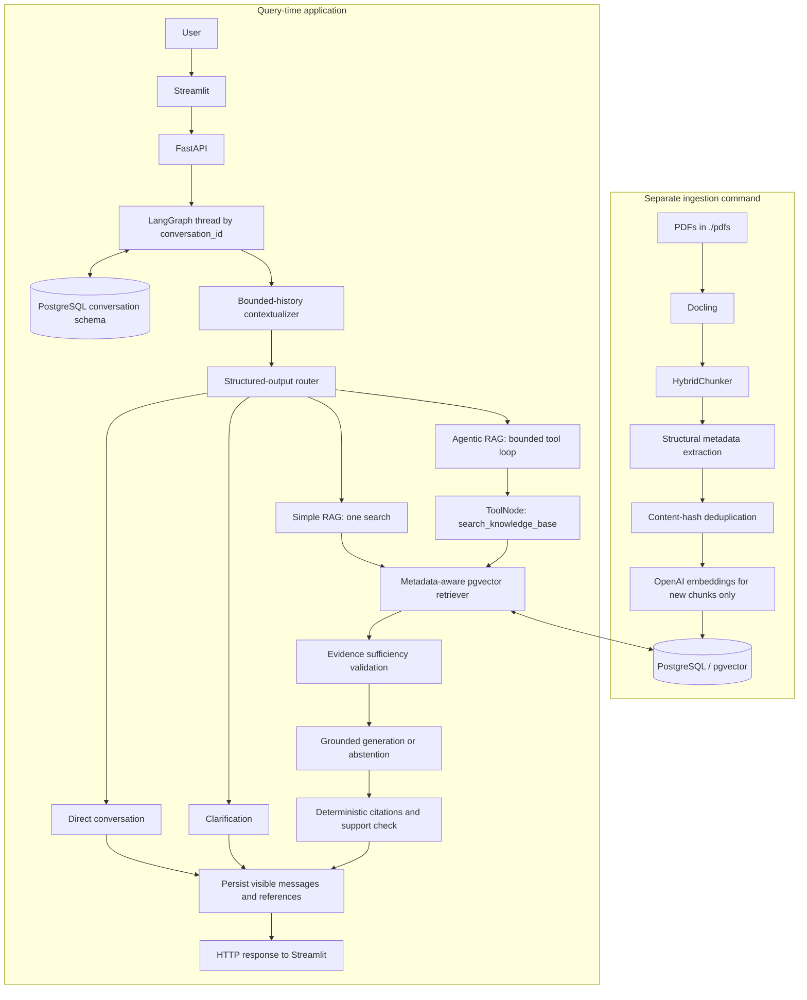

# DocuSense

A conversational RAG application over the PDFs in `./pdfs`. Answers use retrieved document evidence, resolve follow-up questions within a persistent conversation, and carry citations constructed from PostgreSQL metadata. Questions the corpus cannot support receive an abstention.

The project extends the original Docling/HybridChunker ingestion and psycopg/pgvector database code. It keeps ingestion separate from requests and preserves the existing `text-embedding-3-large` 3072-dimensional embeddings. It uses one bounded search agent, not multiple persona agents.

The code is split by responsibility: `src/ingestion/` contains offline PDF processing and write-side storage, `src/assistant/` contains the API, UI, retrieval, and LangGraph agent, and `src/shared/` contains only neutral infrastructure used by both. The ingestion and assistant Docker images install and copy only their respective application packages plus shared code.

## Architecture



During agentic retrieval, the agent inspects tool results and receives evidence-sufficiency feedback after each search. It stops when sufficient, when it repeats a search, or at its call limit. There is no web-search tool. The diagram's generation path runs after evidence collection.

### Why PostgreSQL and LangGraph?

PostgreSQL keeps documents, rich metadata, vectors, and thread checkpoints in one deployable service. psycopg provides straightforward parameterized SQL; an ORM would add little here. pgvector is appropriate for this small corpus and can grow with index tuning, filtering, and operational monitoring.

LangGraph makes contextualization, routing, tool execution, evidence checks, and response persistence explicit and testable. PostgreSQL checkpointing survives API restarts. The graph is constructed once per application lifecycle; request-scoped evidence is never a global conversation dictionary.

### Ingestion and schema

`python -m src.ingestion.ingest` runs Docling conversion, HybridChunker, heading/page/table metadata extraction, hash lookup, new embeddings, and SQL insertion. Unchanged PDFs are parsed again but their existing chunks are **not re-embedded**. Pending duplicate hashes within a run are embedded once. SQL inserts also use `ON CONFLICT` for idempotency.

`documents` contains document ID, title, source path, and ingestion timestamp. `chunks` retains the existing UUID/hash keys, document relationship, full `heading_path`, three convenience heading fields, `page_numbers`, `page_start`, `page_end`, `content_type`, `table_id`, chunk index, text, token count, embedding model/dimensions/vector, and timestamp. There is no legacy singular page field.

The original HNSW declaration on `vector(3072)` exceeded pgvector's vector-index dimension limit. Storage remains full-precision `vector(3072)`; the repaired HNSW index uses the expression `embedding::halfvec(3072)` with cosine distance. Retrieval selects indexed candidates and orders that candidate set using full-precision cosine distance; this is not a learned reranker. All original metadata indexes are created as well. [pgvector index documentation](https://github.com/pgvector/pgvector)

Fresh databases initialize from `sql/schema.sql`. Existing Docker volumes do not rerun initialization scripts: use `python -m src.shared.migrate`, which repairs indexes and creates the logically separate `conversation` checkpoint schema without dropping knowledge-base data. The API image runs this migration before starting.

**Never silently change embeddings.** Startup/readiness, ingestion, and retrieval detect incompatible model/dimension data. Changing the model requires an explicit configuration update and full corpus re-index; changing dimensions additionally requires updating the vector column, expression index, and dimension validation. The index repair itself needs no re-embedding.

### Retrieval, contextualization, and grounding

The retriever returns typed records, joins documents for canonical titles/source paths, and supports allow-listed document IDs/titles, chapter/section/subsection, content type, table ID, and overlapping page numbers. Values are SQL parameters; unknown filters are rejected. Tables retain their identities and provenance.

Before routing or embedding, the contextualizer sees at most six recent turns and a 6,000-token history budget. For example, `Explain HNSW and IVF` followed by `explain with example` becomes a standalone question retaining both subjects. Empty-thread referential questions are clarified; a failed rewrite never silently falls back to raw vague retrieval.

- **Direct:** greetings, thanks, and non-factual conversation management.
- **Clarify:** material ambiguity that history cannot resolve.
- **Simple RAG:** one focused information need and one search.
- **Agentic RAG:** comparisons or multiple independent needs; at most four focused searches by default.

Routing occurs independently each turn. Low-confidence non-clarification decisions conservatively use simple retrieval. Agent searches execute sequentially, validate arguments, deduplicate normalized query/filter combinations, and enforce the call budget before tool execution.

History establishes topics and preferences, not evidence. Retrieved passages are untrusted data; prompts explicitly reject document instructions. Evidence checks consider actual coverage, not just top-1 similarity. Generation returns short blocks with explicit evidence-marker lists. Every block must reference retrieved evidence; the application renders its citations, followed by a model support check. Clearly labelled hypothetical examples may illustrate mechanisms supported by the corpus without requiring verbatim examples in the PDFs. One repair attempt is permitted; persistent failures abstain. Automated model checks reduce hallucination risk but cannot prove factual entailment or guarantee immunity to prompt injection.

Citation markers map only to actual retrieved chunks. Filenames, page lists/ranges, headings, scores, and table IDs come from PostgreSQL. Noncontiguous pages display as a list. The UI never displays tool transcripts or hidden reasoning.

### Conversation persistence

The Streamlit **Conversations** sidebar lists saved chats, newest activity first. Select a title to restore its messages and continue the same thread. **New conversation** opens a blank chat without deleting the previous one; **Refresh** reloads the list, and **Load more** pages through older chats. The active conversation UUID is kept in the URL so browser refresh can restore it. This is shared single-user history: anyone with access to this deployment can browse the saved conversations.

`GET /v1/conversations?offset=0&limit=20` returns `items` (conversation ID, title, update time, message count) and `next_offset`. `GET /v1/conversations/{conversation_id}` returns completed user/assistant messages with available answer metadata. Titles come from the first user message; opening history makes no model calls. Future answers persist their citations and chunk previews with each assistant message. Older messages remain readable and resumable but may lack source details. Restarting services preserves history as long as the PostgreSQL data volume is retained; no re-ingestion or data migration is needed.

Latency optimizations: one structured `context_route` model call resolves history and classifies intent; the router then enforces clarification and confidence policies locally. Evidence assessments are reused within a request only when the question and ordered, score-filtered evidence payload match exactly. A successful simple-RAG turn uses four LLM calls plus one embedding request, excluding retries and repairs. Retrieval uses a separate 1–8 connection pool per API process with a five-second acquisition timeout; connections are released while waiting for embeddings. Citation and support checks remain in place.

An optional UUID `conversation_id` identifies a thread. Messages, routing data, and citation/chunk references persist through `PostgresSaver`; full evidence and tool transcripts remain in request-local `RunContext`. The bounded history window limits model input even though full visible history remains in checkpoints. PostgreSQL advisory locks reject simultaneous requests on the same thread with HTTP 409; different threads can execute concurrently.

A failed process may leave a partial checkpoint. A new request begins a new graph run and rebuilds evidence; transparent resumption of an interrupted tool execution is not implemented. There is no global mutable dictionary used as the production conversation store.

## Local setup

Use Python 3.13 and Docker Compose. Run from the repository root:

```bash
python3.13 -m venv venv
source venv/bin/activate
pip install -r requirements/development.txt
cp .env.example .env
# Edit .env: set OPENAI_API_KEY and POSTGRES_PASSWORD.
# Preserve existing .env/database credentials if continuing an existing installation.
docker compose up -d postgres
python -m src.shared.migrate
python -m src.ingestion.ingest --source-dir ./pdfs
```

Docling's first ingestion can download parsing/OCR models and uses considerably more memory than the query service. The shipped corpus contains four PDFs, including the technical assessment; all are included by default. Choose a different `PDF_DIR`/`--source-dir` to control future ingestion. Removing a PDF does not delete already indexed content.

In separate terminals with the virtual environment activated:

```bash
uvicorn src.assistant.api:app --host 0.0.0.0 --port 8000
streamlit run src/assistant/ui.py
```

Open `http://localhost:8501`. OpenAPI: `http://localhost:8000/docs`. Optional terminal chat: `python -m src.assistant.chat`.

The UI obtains `API_BASE_URL` from its process environment (default `http://localhost:8000`). If using a nondefault local API port, export this variable before launching Streamlit. `API_HOST`/`API_PORT` are consumed by the Docker startup command; specify CLI flags when invoking uvicorn directly.

## Docker deployment

```bash
docker compose up -d --build
# After the API is healthy, ingest separately:
docker compose --profile ingestion up -d --build ingestion-api ingestion-worker
docker compose ps
docker compose logs --tail=100 api ui
```

Services: PostgreSQL/pgvector on 5432, chat API on 8000, Streamlit on 8501, and the optional protected ingestion API on 8001. Published ports bind to localhost. Health checks enforce database → API → UI ordering; the ingestion worker waits for the ingestion API migration/readiness check. The optional ingestion image adds Docling dependencies, persists accepted PDFs in a named upload volume, and uses a named model cache volume. Runtime images run as a non-root user. `.env` is passed at runtime and excluded from the image context. The UI receives no provider or database secrets.

`docker compose down` stops services while retaining the database. Do not use `down -v` unless intentionally deleting the stored knowledge and threads. Existing database passwords are not changed by editing `.env` alone.

## API

```bash
curl http://localhost:8000/health
curl http://localhost:8000/ready
curl -X POST http://localhost:8000/v1/chat \
  -H 'Content-Type: application/json' \
  -d '{"message":"Explain HNSW and IVF."}'
```

Reuse the returned ID:

```json
{"conversation_id":"<returned UUID>","message":"I did not understand, explain with example."}
```

Responses contain `conversation_id`, `answer`, `workflow`, `route_reason`, `citations`, `abstained`, and `latency_ms`. Each citation includes its marker, chunk/document identities, source path, full headings, page list/range, content/table type, table ID, and similarity score. Responses include `X-Request-ID` for diagnostics.

`/health` checks process liveness. `/ready` checks PostgreSQL, embedding compatibility, the HNSW index, and checkpoint availability without calling the paid provider. HTTP 422 indicates invalid input; 409 means the conversation is busy; 503 indicates an unavailable dependency. Unsupported corpus questions return HTTP 200 with `abstained=true`, not an operational error.

## Configuration

See `.env.example` and `src/config.py` for all settings. JSON arrays are used for `CORS_ORIGINS`.

| Settings | Default / purpose |
|---|---|
| `OPENAI_API_KEY` | One secret shared by chat and embeddings |
| `LLM_MODEL`, `LLM_TEMPERATURE` | `gpt-4o-mini`, `0`; legacy `CHAT_MODEL` remains accepted |
| `EMBEDDING_MODEL`, `EMBEDDING_DIMS` | `text-embedding-3-large`, `3072` |
| `POSTGRES_*` | Existing database connection variables |
| `PDF_DIR` | `./pdfs` |
| `INGESTION_API_KEY` | Required admin secret for the dedicated PDF ingestion API |
| `INGESTION_UPLOAD_DIR`, `INGESTION_MAX_UPLOAD_BYTES` | Uploaded-file storage path and 50 MiB default limit |
| `INGESTION_WORKER_POLL_SECONDS`, `INGESTION_JOB_LEASE_SECONDS`, `INGESTION_JOB_MAX_ATTEMPTS` | Worker scheduling and recovery controls |
| `MAX_CHUNK_TOKENS`, `EMBED_BATCH_SIZE` | `512`, `128` |
| `RETRIEVAL_TOP_K`, `RETRIEVAL_CANDIDATE_POOL` | `5`, `25` |
| `RETRIEVAL_SCORE_THRESHOLD` | `0.0`; conservative, not a calibrated relevance guarantee |
| `ROUTER_CONFIDENCE_THRESHOLD` | `0.6` |
| `AGENT_MAX_TOOL_CALLS`, `LANGGRAPH_RECURSION_LIMIT` | `4`, `32` |
| `HISTORY_TURNS`, `HISTORY_TOKEN_BUDGET` | `6`, `6000` |
| `MAX_MESSAGE_CHARS`, `MAX_OUTPUT_TOKENS` | `8000`, `2000` |
| `PROVIDER_TIMEOUT`, `PROVIDER_MAX_ATTEMPTS` | 30 seconds per call, 3 transient attempts |
| `DB_CONNECT_TIMEOUT`, `DB_STATEMENT_TIMEOUT_MS` | 5 seconds, 10,000 milliseconds |
| `LANGFUSE_ENABLED`, `LANGFUSE_*` | Optional metadata-first Langfuse tracing and credentials |
| `APP_ENV`, `LOG_LEVEL`, `API_*`, `CORS_ORIGINS` | Deployment/logging/client settings |

### Langfuse observability

Set `LANGFUSE_ENABLED=true` and provide the Langfuse credentials in `.env` to trace chat requests and ingestion runs. The integration records request/session correlation, workflow stages, model calls and usage when returned by the provider, embedding batches, retrieval scores and chunk IDs, agent search behavior, grounding outcomes, errors, and latency. It is disabled by default and telemetry failures do not fail application requests.

Telemetry is metadata-first: prompts, queries, retrieved text, and answers are bounded and lightly redacted before capture. Embedding vectors, secrets, raw SQL, hidden reasoning, and full document contents are not recorded.

## Testing

Optional DeepEval evaluation is implemented in `scripts/evaluate_rag.py`. The default is a source-reviewed, 30-turn gold benchmark over the indexed four-PDF corpus. It measures factual correctness against reference answers, exact chunk-hash retrieval precision@5/recall@5 on labelled single-search turns, grounding, relevance, routing, citations, abstention, and latency. See [EVALUATION_APPROACH.md](EVALUATION_APPROACH.md) for the dataset, corpus contract, thresholds, reports, and paid live-run commands. Install it separately with `pip install -r requirements/evaluation.txt`.

```bash
# Validate the 30-turn gold dataset only; no database or provider calls.
.venv/bin/python -m scripts.evaluate_rag

# Keep the original six-case smoke suite available explicitly.
.venv/bin/python -m scripts.evaluate_rag --dataset evals/cases.json

# Run the real graph and paid application/judge calls after migration and ingestion.
.venv/bin/python -m scripts.evaluate_rag --live --judge-model gpt-4.1
```

The gold dataset is tied to the reviewed 146-chunk corpus fingerprint. A live run rejects a changed or incomplete corpus before evaluating; update and source-review the labels when the knowledge base changes.

Unit tests, graph tests, HTTP tests, and Streamlit AppTest tests do not invoke paid services:

```bash
pytest
ruff check src tests scripts
ruff format --check src tests scripts
mypy src
pip check
```

Integration tests use real PostgreSQL and deterministic model/embedding adapters. Create a dedicated database ending in `_test` with the same local credentials:

```bash
docker compose exec postgres sh -c 'createdb -U "$POSTGRES_USER" rag_pipeline_test'
TEST_DATABASE_NAME=rag_pipeline_test pytest -m integration
```

Do not recreate it if it already exists. Without `TEST_DATABASE_NAME`, integration tests are explicitly skipped. They check repeatable migrations, real filtered vector retrieval, metadata/citations, HTTP → graph → PostgreSQL execution, persistence across application recreation, isolation, and thread locking. Fixture document rows are removed afterwards; test checkpoints remain in the disposable test database.

With the API running, explicitly exercise the paid live scenarios:

```bash
python scripts/manual_regression.py
```

This runs A–F and records HTTP outputs in `artifacts/manual_regression.json`. See `VERIFICATION.md` for the actual checks run during implementation, including limitations; fake-provider tests are not substitutes for live-provider regression results.

## Reliability, security, and tradeoffs

- Structured logs include request/conversation IDs, workflow, search count, abstention, and safe exception type. A provider adapter and retriever protocol allow later evaluation instrumentation without changing graph policy.
- Provider retries are bounded, with backoff for transient connection/timeout/server/rate errors. Quota exhaustion, insufficient credit, authentication failures, and other permanent errors are not retried. Database operations have timeouts; agent and graph loops have independent bounds.
- Model-based contextualization, routing, evidence assessment, generation, and support checks increase cost/latency relative to a single-prompt RAG baseline. Agentic searches add more calls. Ingestion avoids repeated embedding charges but still reparses unchanged documents.
- ANN is approximate; half-precision candidates can miss results. Filtering and a larger candidate pool can help. Tune thresholds and recall using a labelled corpus rather than a single observed score.
- SQL filters are parameterized and allow-listed. Message length and UUIDs are validated. Errors do not return stack traces or rejected input. There is no ingestion endpoint or arbitrary-SQL/web tool.
- This is a local take-home deployment, **not an authenticated multi-tenant service**. Possession of a conversation UUID is not authorization. Add authentication, per-user thread ownership, TLS, rate limits, separate migration/runtime database roles, backups, and retention policy before external exposure.
- Provider prompts contain retrieved document text and bounded conversation history. Ensure those documents may be sent to the configured provider. Secret values are masked in settings and excluded from Git/images.

### Known limitations

The existing global text hash deduplicates identical text across documents and locations; it can retain only the first provenance record. Changing/removing PDFs does not reconcile obsolete chunks. These semantics are retained to avoid silently migrating existing data; a document-version/provenance migration is needed to improve them. Concurrent ingestion processes may still both embed a new chunk before the unique constraint resolves the write, so run one ingestion job at a time.

Checkpoint history has no automated retention or compaction. Model context excludes turns outside its bounded window; old references may require clarification even when the full conversation is displayed. Thread IDs are not an authentication mechanism; the history endpoints expose all saved chats in this single-user deployment. There is no streaming, learned reranking, lexical search, or exhaustive guarantee of grounding.

### Future improvements — not implemented

- Learned reranking and hybrid dense + lexical retrieval.
- Langfuse/observability and operational dashboards.
- Production authentication and tenant-aware authorization.
- Document versioning, provenance-aware deduplication, checkpoint retention, and history summarization.
